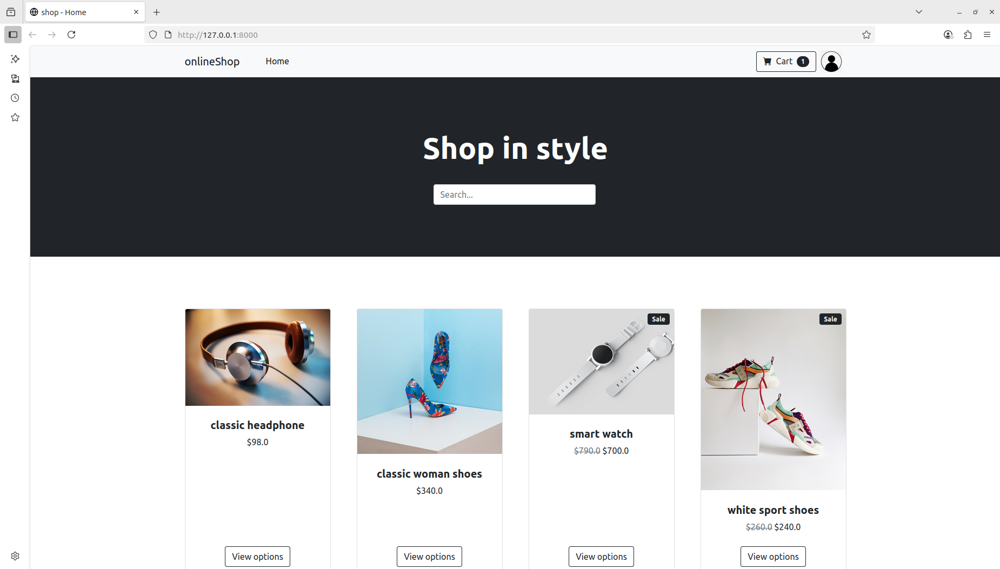

# 🚀 **DevOps Project: Online shopping website Deployment Based on Production Level**

**Deploying Jenkins on one region (us-east-2) and Docker, Sonarqube are on another region (us-east-1)** 

In this production-level DevOps project, developers push code that flows through an approval-driven promotion pipeline—from the initial testing branch, where the testing team reviews and authorizes the changes, to the pre-production (preprod) branch, pending the preprod team's sign-off, and finally into the main branch after main team approval. Once merged into main, Jenkins automatically builds the code, runs static code analysis via SonarQube, performs file-level vulnerability scanning with Trivy, builds a Docker image that it again scans with Trivy, then pushes the secured image to Docker Hub. Deployment is managed via Argo CD following GitOps principles. ontinuous monitoring is achieved using Prometheus for metrics collection and Grafana for visual dashboards, ensuring real-time observability and reliability.

## **Phase 1: Test locally**

**Step 1: clone the repository**

```bash
git clone https://github.com/didin8080/Online-shop.git
```

**Step 2:Test it locally**

```bash
sudo apt update
sudo apt install python3 python3-pip python3-venv -y
```

Create virtual environment


```bash
python3 -m venv venv
source venv/bin/activate
```

Install Dependencies

```bash
sudo apt-get install -y python3-dev python3-pip python3-venv \
    libjpeg-dev zlib1g-dev libfreetype6-dev \
    liblcms2-dev libopenjp2-7-dev libtiff5-dev \
    tk-dev tcl-dev libharfbuzz-dev libfribidi-dev \
    libwebp-dev libxcb1-dev
```

```bash
pip install --upgrade pip setuptools wheel
pip install --no-cache-dir Pillow
```

```bash
pip install -r requirements.txt
```


```bash
python3 manage.py migrate

python3 manage.py runserver 0.0.0.0:8000
```

It will generate an ip address copy ip and paste it on the browser.


Online-shop  Project by Didin `<127.0.0.1:8000>`

<div align="center">

<p align="center"> Tested locally</p>
</div>

## **Phase 2: Configure on Github **

Create a  Github Repository for the web-application. Create 4 branch dev (developer), test (tester), prepod (preproduction), main (Production).

**Assign branch  Protection rules for test, prepod, main branch.**

For test branch:

 - Require a pull request before merging 
 - Require approvals – atleast one approval is required
 - Dismiss stale pull request approvals when new commits are pushed
 - Require review from Code Owners
 - Require linear history 

For prepod branch:

 - Require a pull request before merging 
 - Require approvals – atleast one approval is required
 - Dismiss stale pull request approvals when new commits are pushed 
 - Require review from Code Owners 
 - Require approval of the most recent reviewable push 
 - Require linear history
 - Allow force pushes

For main branch:

 - Require a pull request before merging 
 - Require approvals – atleast one approval is required
 - Dismiss stale pull request approvals when new commits are pushed 
 - Require review from Code Owners 
 - Require status checks to pass before merging
 - Allow force pushes
 - Allow deletions

**Goto Collaborators on Github and add  Collaborators for approval for the code.**

Add 3 or more people 

 - one for test branch
 - 2nd one for prepod branch
 - 3rd one for main branch

**Add webhook**

Copy the ip of jenkins and paste it with /github-webhook/ .
Ex ( http://1.1.1.0:8080/github-webhook/)

Change the content type to (application/json)

Enable let me select individual event

    • Branch protection configurations 
    • Branch protection rules 
    • Bypass requests for push rulesets 
    • Check runs 
    • Code scanning alerts 
    • Collaborator add, remove, or changed 
    • Dependabot alerts 
    • Deploy keys 
    • Deployment statuses 
    • Deployments 
    • Discussion comments 
    • Discussions 
    • Dismissal requests for code scanning alerts 
    • Dismissal requests for secret scanning alerts 
    • Labels 
    • Merge groups 
    • Milestones 
    • Packages 
    • Pull request review comments 
    • Pull request review threads 
    • Pull request reviews 
    • Pull requests 
    • Pushes 
    • Registry packages 
    • Releases 
    • Repositories 
    • Repository advisories 
    • Repository imports
    • Repository rulesets 
    • Repository vulnerability alerts 
    • Secret scanning alert locations 
    • Secret scanning alerts 
    • Secret scanning scans 
    • Security and analyses 
    • Statuses
    • Sub issues
    •  Team adds
    •  Visibility changes 
    • Watches
    •  Wiki
    •  Workflow jobs
    • Workflow runs 

  Enable above Events. Create Webhook.

**Goto Environments  on Github and add  Environments  to provide protection rule for the Collaborators**

For test branch
- Required reviewers
  - Select any reviewers from testing team
- On Deployment branches and tags  
  -  Select ( Selected Branches and tags)
- Add test branch 

For prepod branch
- Required reviewers
  - Select any reviewers from preproduction team
- On Deployment branches and tags  
  -  Select ( Selected Branches and tags)
- Add prepod branch 

For main branch
- Required reviewers
  - Select any reviewers from production team
- On Deployment branches and tags  
  -  Select ( Selected Branches and tags)
- Add main branch 

Now the developer pushes the code to Github . The developer wants to  create a pull request to test branch , After the approval of the testing team it will merge to test branch . Now the tester want to create a pill request to prepod branch , After the approval of preproduction team it will merge to prepod branch . The preproduction team will create a pull request to main branch , After the approval of the production manager it will merge to main branch . 

In sometime there is a file , we want to update the file . We  had updated while pushing a  conflict will occur to resolve it .   


```bash
git fetch origin
```

```bash
git chekout main
```

```bash
git pull main
```

```bash
git checkout prepod
```

```bash
git merge main
```

**you will get what is the conflict sort it out**

```bash
git add .
```

```bash
git commit -m “sorted out the conflict”
```

```bash
git push origin prepod
```

Here i got the conflict error while pushing from prepod to main. If you got the conflict error from test to prepod . Change the above command main-->prepod prepod-->test.


## **Phase 3: Deploy Application on Docker**

**Step 1: Launch EC2 (ubuntu 22.04) on (us-east-2) region**

- Provision an EC2 instance on AWS with Ubuntu 22.04,volume 29gb,t3.medium. 
- Connect to the instance using SSH.
- Allow ports

  - SMTP 25
  - CUSTOM TCP 3000 - 10000
  - HTTP 80
  - HTTPS 443
  - SSH 22
  - CUSTOM TCP 6443
  - SMTPS 465
  - CUSTOM TCP 8000

**Step 2: update the Package**


```bash
sudo apt-get update
```

**Step 3: clone the repository**

```bash
git clone 
```

**Step 4: Install python**

```bash
sudo apt update
sudo apt install python3 python3-pip python3-venv -y
```

**Step 5: create virtual environment**

```bash
python3 -m venv venv
source venv/bin/activate
```

**Step 6: Install Dependencies**


```bash
sudo apt-get install -y python3-dev python3-pip python3-venv \
    libjpeg-dev zlib1g-dev libfreetype6-dev \
    liblcms2-dev libopenjp2-7-dev libtiff5-dev \
    tk-dev tcl-dev libharfbuzz-dev libfribidi-dev \
    libwebp-dev libxcb1-dev
```

```bash
pip install --upgrade pip setuptools wheel
pip install --no-cache-dir Pillow
```

```bash
pip install -r requirements.txt
```

**Step 7:Install Jenkins on ubuntu**


```bash
sudo apt update -y

wget -O - https://packages.adoptium.net/artifactory/api/gpg/key/public | sudo tee /etc/apt/keyrings/adoptium.asc

echo "deb [signed-by=/etc/apt/keyrings/adoptium.asc] https://packages.adoptium.net/artifactory/deb $(awk -F= '/^VERSION_CODENAME/{print$2}' /etc/os-release) main" | sudo tee /etc/apt/sources.list.d/adoptium.list

sudo apt update -y

sudo apt install temurin-17-jdk -y

/usr/bin/java --version

curl -fsSL https://pkg.jenkins.io/debian-stable/jenkins.io-2023.key | sudo tee /usr/share/keyrings/jenkins-keyring.asc > /dev/null

echo deb [signed-by=/usr/share/keyrings/jenkins-keyring.asc] https://pkg.jenkins.io/debian-stable binary/ | sudo tee /etc/apt/sources.list.d/jenkins.list > /dev/null

sudo apt-get update -y

sudo apt-get install jenkins -y

sudo systemctl start jenkins

sudo systemctl status jenkins
```

`publicIp:8080`


**Step 8: Install Trivy on ubuntu**


```bash
sudo apt-get install wget apt-transport-https gnupg

wget -qO - https://aquasecurity.github.io/trivy-repo/deb/public.key | gpg --dearmor | sudo tee /usr/share/keyrings/trivy.gpg > /dev/null

echo "deb [signed-by=/usr/share/keyrings/trivy.gpg] https://aquasecurity.github.io/trivy-repo/deb generic main" | sudo tee -a /etc/apt/sources.list.d/trivy.list

sudo apt-get update

sudo apt-get install trivy
```

**Create a Dockerfile and Push to Github**

```bash
nano dockerfile
```

paste it inside 


```bash
FROM python:3.11-slim

# Prevent Python from writing .pyc files and buffer outputs
ENV PYTHONDONTWRITEBYTECODE=1
ENV PYTHONUNBUFFERED=1

WORKDIR /app

# Copy requirements for dependency installation
COPY requirements.txt /app/

# Install system dependencies needed for building Pillow
RUN apt-get update && \
    apt-get install -y --no-install-recommends \
        gcc \
        zlib1g-dev \
        libjpeg-dev && \
    rm -rf /var/lib/apt/lists/*

# Upgrade pip then install Python dependencies
RUN pip install --upgrade pip && \
    pip install -r requirements.txt

COPY . /app/

EXPOSE 8000

CMD python3 manage.py migrate && python3 manage.py runserver 0.0.0.0:8000
```

**Step 9: Launch EC2 (ubuntu 22.04) on (us-east-1) region**

- Provision an EC2 instance on AWS with Ubuntu 22.04,volume 29gb,t3.large. 
- Connect to the instance using SSH.
- Allow ports

  - SMTP 25
  - CUSTOM TCP 3000 - 10000
  - HTTP 80
  - HTTPS 443
  - SSH 22
  - CUSTOM TCP 6443
  - SMTPS 465
  - CUSTOM TCP 8000


**Step 10: update the Package**


```bash
sudo apt-get update
```


**Step 11: clone the repository**

```bash
git clone https://github.com/didin8080/Class-manager.git
```


**Step 12: Install Docker on ubuntu**

```bash
sudo apt-get update

sudo apt-get install ca-certificates curl

sudo install -m 0755 -d /etc/apt/keyrings

sudo curl -fsSL https://download.docker.com/linux/ubuntu/gpg -o /etc/apt/keyrings/docker.asc

sudo chmod a+r /etc/apt/keyrings/docker.asc

# Add the repository to Apt sources:

echo \
  "deb [arch=$(dpkg --print-architecture) signed-by=/etc/apt/keyrings/docker.asc] https://download.docker.com/linux/ubuntu \
  $(. /etc/os-release && echo "$VERSION_CODENAME") stable" | \
  sudo tee /etc/apt/sources.list.d/docker.list > /dev/null

sudo apt-get update

sudo apt-get install docker-ce docker-ce-cli containerd.io docker-buildx-plugin docker-compose-plugin -y

sudo usermod -aG docker ubuntu

sudo chmod 777 /var/run/docker.sock

newgrp docker

sudo systemctl status docker
```

**Step 13: Install SonarQube using Docker**

```bash
docker run -d --name sonar -p 9000:9000 sonarqube:lts-community
```

`publicIp:9000`


**Step 14: Install Trivy on ubuntu**


```bash
sudo apt-get install wget apt-transport-https gnupg

wget -qO - https://aquasecurity.github.io/trivy-repo/deb/public.key | gpg --dearmor | sudo tee /usr/share/keyrings/trivy.gpg > /dev/null

echo "deb [signed-by=/usr/share/keyrings/trivy.gpg] https://aquasecurity.github.io/trivy-repo/deb generic main" | sudo tee -a /etc/apt/sources.list.d/trivy.list

sudo apt-get update

sudo apt-get install trivy
```

**Step 15: Install necessary plugins on Jenkins**

- Eclipse Temurin installer
- Pipeline: Stage View 
- SonarQube Scanner
- Docker 
- Docker Commons 
- Docker Pipeline Version 
- Docker API
- docker-build-step
- SSh agent
- Git Pipeline for Blue Ocean
- P4
- Gitea
- Git Push 
- Poll SCM 
- SCM Sync Configuration 
- Gradle Repo
- SCM Skip
- SCM to job
- SCM-Manager Version 
- Pipeline SCM API for Blue Ocean Version 
- prometheus metrics

From `Git Pipeline for Blue Ocean` to  `Pipeline SCM API for Blue Ocean Version` are used to automate the pipeline .If developer push the code the jenkins pipeline automatically runs.

Add webhook on github.

**Step 16: Tools configuration in jenkins**

Goto Jenkins dashboard--> Manage Jenkins --> tools 
- add jdk,give name as jdk17 ,install automatically ,add installer, install from adoptium.net, select jdk-17.0.8.1+1 
- add sonarqube scanner--> name= sonar-scaner,insall automatically,
- add docker --> name=docker,install automatically,add installer ,download from docker.com
- apply and save

**Step 17: Create token on Docker**

Goto dockerhub --> goto profile --> Account settings --> Personal access token --> Generate new token --> give any name --> Access permission = read and write.


**Step 18: ADD Credentials on Jenkins**

- On sonarqube -> admininstration-->security--> user--> rightside 3dots--> give any name --> generate token

- On jenkins --> manage jenkins-->credentials-->global--> add credentials--> kind=secret text --> on secret paste the sonarqube token and give any name and description-->give sonar-token and description-->create

- On jenkins --> manage jenkins-->credentials-->global--> add credentials--> kind=secret text --> on secret paste the docker token and give any name and description-->give name as docker and description-->create

- On jenkins --> manage jenkins-->credentials-->global--> add credentials--> kind=username with password--> username= provide your mail id -->password= the APP PASSWORD that you created --> id smtp.

- On jenkins --> manage jenkins-->credentials-->global--> add credentials-->SSH username with privatekey --> ID = ssh-agent --> description = ssh-agent --> username = ubuntu --> enable private key entire directly --> copy the key inside the pem file and paste it here and add a  new line. -->Create


**Step 19: System Configuration in Jenkins**

On jenkins--> manage jenkins--> system

- add sonarqube server -->give name as sonar-server--> on server url= paste the url of sonarqube -->select the authentication --> apply and save .

- Extended email notification --> On SMTP server= smtp.gmail.com --> SMTP port = 465 -->advanced --> enale use SSL --> on credentails = add credentials that we added for gmail

- E-mail Notification --> On SMTP server = smtp.gmail.com --> advanced --> enable use ssl --> smtp port 465--> enable use SMTP authentication --> username= your-email-id --> on password = app password `eg:(drsn anne afrd pcfx)`--> enable test configuration by sending email --> enter our email--> test configuration --> Goto your email you will get an test email from jenkins --> apply and save

**Step 20: Create webhook in sonarqube**

- on jenkins--> manage jenkins--> system--> add sonarqube server -->give name as sonar-server--> on server url= paste the url of sonarqube with sonarqube-webhook eg:**(192.168.20.173:8080/sonarqube-webhook)** -->select the authentication --> apply and save .

**Step 21: Create a docker repository and make it public**

Goto docker repository --> Create repository -->give any repository name --> On visibility make it private --> if you cant make it private means any other repository will be private so make that repository public and make new one private.

**Step 22: To add ssh agent on jenins**

goto docker  terminal 

```bash
nano /etc/docker/daemon.json
```
--> provide permission 666


paste inside

```bash
{
  "hosts": ["unix:///var/run/docker.sock", "tcp://0.0.0.0:2375"]
}
```

save it

```bash
sudo systemctl edit docker.service
```
add the following thing and override

```bash
[Service]
ExecStart=
ExecStart=/usr/bin/dockerd
```

Restart docker


```bash
sudo systemctl daemon-reload
sudo systemctl restart docker
```

- Goto jenkins dashboard, manage jenkins --> clouds --> new cloud --> give any name --> on docker host url `tcp://public-ip of docker instance:2375` --> tick the box Enabled --> test connection .

you will see the version and api version .

**Step 23: Create a docker volume**

Go inside the Directory

```bash
cd /var/lib/docker/volumes
```

Create volume

```bash
docker volume create myvol
```
Here myvol is the volume name that we created.

**Step 24: Create a Directory and mount to S3-Bucket**

```bash
sudo -i
```

Install awscli

```bash
sudo apt install unzip
curl "https://awscli.amazonaws.com/awscli-exe-linux-x86_64.zip" -o "awscliv2.zip"
unzip awscliv2.zip
sudo ./aws/install
aws --version
```

Install S3fs

```bash
sudo apt-get update
sudo apt-get install s3fs
```

create IAM role (s3full access) attach with user

```bash
echo ACCESS_KEY_ID:SECRET_ACCESS_KEY > ~/.passwd-s3fs
chmod 600 ~/.passwd-s3fs
```

```bash
mkdir ~/s3-bucket-mount
```

ADD the mount point on fstab

```bash
echo "s3fs#didin-buckets /root/s3-bucket-mount fuse _netdev,allow_other,passwd_file=/root/.passwd-s3fs 0 0" | sudo tee -a /etc/fstab
```

```bash
sudo mount /root/s3-bucket-mount
```

```bash
systemctl daemon-reload
```

Check the mount 

```bash
mount | grep s3fs
```

**Step 25: Install zip**

```bash
sudo apt update
sudo apt install zip unzip
```

**Step 26: Create backup.sh file to automate the backup**

```bash
cd /home/ubuntu
```

```bash
touch backup.sh
```

paste it inside

```bash
#!/bin/sh
set -e

CONTAINER="online-shop"
S3_PATH="/root/s3-bucket-mount"
DATE=$(date +%F)
TIME=$(TZ=Asia/Kolkata date +%F-%H%M%S)
BACKUP_TYPE=$1

# --- Database Backup ---
if [ "$BACKUP_TYPE" = "db" ]; then
    TMP_FILE="db-backup-${TIME}.zip"
    docker cp "$CONTAINER:/app/db.sqlite3" ./db.sqlite3
    zip "$TMP_FILE" db.sqlite3
    mv "$TMP_FILE" "$S3_PATH/"
    rm db.sqlite3

    # Keep last 7 db backups
    cd "$S3_PATH"
    ls -t db-backup-*.zip | sed -e '1,7d' | xargs -r rm --
fi

# --- Full App Backup ---
if [ "$BACKUP_TYPE" = "full" ]; then
    TMP_FILE="full-backup-${DATE}.zip"
    docker cp "$CONTAINER:/app/" ./appdata
    zip -r "$TMP_FILE" ./appdata
    mv "$TMP_FILE" "$S3_PATH/"
    rm -rf ./appdata

    # Keep last 7 full backups
    cd "$S3_PATH"
    ls -t full-backup-*.zip | sed -e '1,7d' | xargs -r rm --
fi
```

Add executable permission for the file

```bash
sudo chmod +x backup.sh
```

Set the TimeZone as Asia/Kolkata

```bash
sudo timedatectl set-timezone Asia/Kolkata

timedatectl
```


**Step 27: Write a Cronjob**

```bash
crontab -e
```

```bash
# DB backup at 10 AM
0 10 * * * /home/ubuntu/backup.sh db >> /home/ubuntu/backup.log 2>&1

# DB backup at 6 PM
0 18 * * * /home/ubuntu/backup.sh db >> /home/ubuntu/backup.log 2>&1

# Full backup at 8 PM
0 20 * * * /home/ubuntu/backup.sh full >> /home/ubuntu/backup.log 2>&1
```


**Step 28: Configure CI/CD pipeline in jenkins**

Before pasting the pipeline script, do the following changes in the script
1. In the stage 'Tag and Push to DockerHub', give your docker-hub username.
2. In post actions stage in pipeline, make sure to give the email id you have configured in jenkins.
3. Replace the checkout repo and generate the link using Pipeline Syntax
4. while generating the github link will be in private.To get the link add credentials on the link 
5. REplace the ip of docker instance on docker stage and docker image replace the entire think.
### Major things that you wnat to edit in this project .Goto `lapzone/settings.py` on `ALLOWED_HOSTS` provide your `public-ip` of docker instance and save it.Push to Github And build it.

```groovy
pipeline {
    agent any
    environment{
        SCANNER_HOME = tool 'sonar-scanner'
        DOCKER_REGISTRY = 'didin8080'
        IMAGE_NAME = "online-shop"
        IMAGE_FULL_NAME = "didin8080/online-shop"
    }
    stages {
        stage('Clean Workspace') {
            steps {
                cleanWs()
            }
        }
       stage('Checkout from GitHub') {
            steps {
                git branch: 'main', url: 'https://github.com/didin2003/online-shop.git'
                script {
                    def hash = sh(script: "git rev-parse --short HEAD", returnStdout: true).trim()
                    def timestamp = new Date().format('yyyyMMddHHmmss')
                    env.COMMIT_HASH = hash
                    env.IMAGE_VERSION = "${hash}-${timestamp}"
                    env.ZIP_NAME = sh(script: "date +%F", returnStdout: true).trim()
                    env.ZIP_TIME = sh(script: "TZ=Asia/Kolkata date +%F-%H%M%S", returnStdout: true).trim()
                }
            }
       }
        stage('Sonarqube analysis') {
            steps {
                withSonarQubeEnv('sonar-server') {
                    sh """
                        $SCANNER_HOME/bin/sonar-scanner \
                        -Dsonar.projectKey=online \
                        -Dsonar.sources=. \
                        -Dsonar.host.url=http://3.18.253.200:9000 \
                      """
                }
            }
        }
        stage('quality gate') {
            steps {
                waitForQualityGate abortPipeline: false, credentialsId: 'sonar-token'
            }
        }
        stage('Trivy Filesystem Scan') {
            steps {
                script {
                    catchError(buildResult: 'SUCCESS', stageResult: 'UNSTABLE') {
                        def template = fileExists('html.tpl') ? '@html.tpl' : 'table'
                        sh """
                            mkdir -p ${TRIVY_CACHE_DIR}
                            trivy fs --scanners vuln,misconfig --cache-dir ${TRIVY_CACHE_DIR} \
                                --format template --template ${template} -o trivy-fs-report.html . || echo "Trivy FS scan completed with findings"
                        """
                        archiveArtifacts artifacts: 'trivy-fs-report.html'
                        def fsReport = readFile('trivy-fs-report.html')
                        env.FS_SCAN_CRITICAL = fsReport.contains('CRITICAL') ? 'Yes' : 'No'
                        if (env.FS_SCAN_CRITICAL == 'Yes') {
                            error("Critical vulnerabilities found in filesystem scan")
                        }
                    }
                }
            }
        }
        stage('Build and tag docker image (Remote)') {
            steps {
                sshagent(['ssh-docker']) {
                    sh """
                         ssh -o StrictHostKeyChecking=no ubuntu@3.18.253.200 << 'EOF'
                             set -e
                             cd /home/ubuntu
                             rm -rf online-shop || true
                             git clone https://github.com/didin2003/online-shop.git
                             cd online-shop
                             git pull origin main
                             docker system prune -a -f
                             docker build -t ${IMAGE_FULL_NAME}:${IMAGE_VERSION} .
                             docker tag ${IMAGE_FULL_NAME}:${IMAGE_VERSION} ${IMAGE_FULL_NAME}:latest
EOF
                     """
                 }
            }
        }
        stage('Trivy Image Scan (Remote)') {
            steps {
                script {
                    catchError(buildResult: 'SUCCESS', stageResult: 'UNSTABLE') {
                        sshagent(['ssh-docker']) {
                           sh """
                               ssh -o StrictHostKeyChecking=no ubuntu@3.18.253.200 << 'EOF'
                               cd ~
                               wget -qO html.tpl https://raw.githubusercontent.com/aquasecurity/trivy/main/contrib/html.tpl || true
                               trivy image --format template \
                                 --template "@/home/ubuntu/html.tpl" \
                               -o trivy-image-report.html ${IMAGE_FULL_NAME}:${IMAGE_VERSION} || true
EOF
                              """
                        }
                        archiveArtifacts artifacts: 'trivy-image-report.html'
                        def imageReport = readFile('trivy-image-report.html')
                        env.IMAGE_SCA$ZIP_NAMEN_CRITICAL = imageReport.contains('CRITICAL') ? 'Yes' : 'No'
                        if (env.IMAGE_SCAN_CRITICAL == 'Yes') {
                            error("Critical vulnerabilities found in image scan")
                        }
                    }
                }
            }
        }
        stage('Push Docker Image (Remote)') {
            steps {
               withCredentials([string(credentialsId: 'docker', variable: 'DOCKER_TOKEN')]) {
                    sshagent(['ssh-docker']) {
                        sh """
                            ssh -o StrictHostKeyChecking=no ubuntu@3.18.253.200 << 'EOF'
                                set -x
                                mkdir -p ~/.docker
                                echo '{ "credsStore": "" }' > ~/.docker/config.json
                                echo "${DOCKER_TOKEN}" | docker login -u didin8080 --password-stdin
                                docker images
                                docker push ${IMAGE_FULL_NAME}:${IMAGE_VERSION} || true
                                docker push ${IMAGE_FULL_NAME}:latest
EOF
                        """
                    }
                }
            }
        }
        stage('Deploy to Cloud Instance (Remote)') {
            steps {
                sshagent(['ssh-docker']) {
                    sh """
                        ssh -o StrictHostKeyChecking=no ubuntu@3.18.253.200 << 'EOF'
                            docker pull ${IMAGE_FULL_NAME}:latest
                            docker stop online-shop || true
                            docker rm online-shop || true
                            sudo su
                            cd /var/lib/docker/volumes/myvol/_data
                            docker run -d --name online-shop -v /var/lib/docker/volumes/myvol/_data/:/app/data/ -p 8000:8000 --restart unless-stopped ${IMAGE_FULL_NAME}:latest
                            sleep 10
                            docker cp online-shop:/app/. /var/lib/docker/volumes/myvol/_data/
                            if [ -f "db.sqlite3" ]; then
                               zip "db-backup-${ZIP_TIME}.zip" db.sqlite3
                               mv "db-backup-${ZIP_TIME}.zip" /root/s3-bucket-mount/
                            fi
                            zip -r "full-backup-${ZIP_NAME}.zip" .
                            mv "full-backup-${ZIP_NAME}.zip" /root/s3-bucket-mount/
                            rm -rf /var/lib/docker/volumes/myvol/_data/*
EOF
                    """
                }
            }
        }
    }
    post {
    always {
        emailext attachLog: true,
            subject: "'${currentBuild.result}'",
            body: """
                <html>
                <body>
                    <div style="background-color: #FFA07A; padding: 10px; margin-bottom: 10px;">
                        <p style="color: white; font-weight: bold;">Project: ${env.JOB_NAME}</p>
                    </div>
                    <div style="background-color: #90EE90; padding: 10px; margin-bottom: 10px;">
                        <p style="color: white; font-weight: bold;">Build Number: ${env.BUILD_NUMBER}</p>
                    </div>
                    <div style="background-color: #87CEEB; padding: 10px; margin-bottom: 10px;">
                        <p style="color: white; font-weight: bold;">URL: ${env.BUILD_URL}</p>
                    </div>
                </body>
                </html>
            """,
            to: 'didinpg8080@gmail.com',
            mimeType: 'text/html',
            attachmentsPattern: 'trivy.txt'
        }
    }
}
```
### Build it

If it get success


Your application is deployed in docker to access it. 

`<public-ip:8000>`

<div align="center">

<p align="center"> Home Page </p>
</div>

## **Phase 4: Moniter the Application**

**Step 1: Launch EC2 (Ubuntu 22.04) on us-east-2 Region**

- Provision an EC2 instance on AWS Name: Monitoring Server, Ubuntu 24.04, t2.large, Select the SG created in the Step 1, EBS: 30GB.
- Connect to the instance using SSH.
- - Allow ports

  - HTTP 80
  - HTTPS 443
  - SSH 22
  - CUSTOM TCP 9090
  - CUSTOM TCP 3000

We will install Grafana, Prometheus, Node Exporter in the above instance and then we will monitor


**Step 2: Update the packages**

```bash
sudo apt-get update
```


**Step 3: Installing Prometheus**

```bash
sudo useradd --system --no-create-home --shell /bin/false prometheus

wget https://github.com/prometheus/prometheus/releases/download/v2.47.1/prometheus-2.47.1.linux-amd64.tar.gz

#Extract Prometheus files, move them, and create directories:
tar -xvf prometheus-2.47.1.linux-amd64.tar.gz

cd prometheus-2.47.1.linux-amd64/

sudo mkdir -p /data /etc/prometheus

sudo mv prometheus promtool /usr/local/bin/

sudo mv consoles/ console_libraries/ /etc/prometheus/


sudo mv prometheus.yml /etc/prometheus/prometheus.yml

#Set ownership for directories:
sudo chown -R prometheus:prometheus /etc/prometheus/ /data/
```

**Create a systemd unit configuration file for Prometheus:**

```bash
sudo vi /etc/systemd/system/prometheus.service
```

**Add the following content to the prometheus.service file:**

```plaintext
[Unit]
Description=Prometheus
Wants=network-online.target
After=network-online.target

StartLimitIntervalSec=500
StartLimitBurst=5

[Service]
User=prometheus
Group=prometheus
Type=simple
Restart=on-failure
RestartSec=5s
ExecStart=/usr/local/bin/prometheus \
  --config.file=/etc/prometheus/prometheus.yml \
  --storage.tsdb.path=/data \
  --web.console.templates=/etc/prometheus/consoles \
  --web.console.libraries=/etc/prometheus/console_libraries \
  --web.listen-address=0.0.0.0:9090 \
  --web.enable-lifecycle

[Install]
WantedBy=multi-user.target
```

**Enable and start Prometheus:**

```bash
sudo systemctl enable prometheus
sudo systemctl start prometheus
```

**Verify Prometheus's status:**

```bash
sudo systemctl status prometheus
```

Press Control+c to come out


Access Prometheus in browser using your server's IP and port 9090:

`http://<your-server-ip>:9090`

Click on 'Status' dropdown ---> Click on 'Targets' ---> You can see 'Prometheus (1/1 up)'


**Step 4: Installing Node Exporter**

```bash
cd 

sudo useradd --system --no-create-home --shell /bin/false node_exporter

wget https://github.com/prometheus/node_exporter/releases/download/v1.6.1/node_exporter-1.6.1.linux-amd64.tar.gz

#Extract Node Exporter files, move the binary, and clean up:
tar -xvf node_exporter-1.6.1.linux-amd64.tar.gz

sudo mv node_exporter-1.6.1.linux-amd64/node_exporter /usr/local/bin/

rm -rf node_exporter*
```

**Create a systemd unit configuration file for Node Exporter:**

```bash
sudo vi /etc/systemd/system/prometheus.service
```

**Add the following content to the node_exporter.service file:**

```plaintext
[Unit]
Description=Node Exporter
Wants=network-online.target
After=network-online.target

StartLimitIntervalSec=500
StartLimitBurst=5

[Service]
User=node_exporter
Group=node_exporter
Type=simple
Restart=on-failure
RestartSec=5s
ExecStart=/usr/local/bin/node_exporter --collector.logind

[Install]
WantedBy=multi-user.target
```


**Enable and start Node Exporter:**

```bash
sudo systemctl enable node_exporter
sudo systemctl start node_exporter
```

**Verify Node Exporter status:**

```bash
sudo systemctl status node_exporter
```

Press Control+c to come out


**Step 5: Configure Prometheus Plugin Integration**

As of now we created Prometheus service, but we need to add a job in order to fetch the details by node exporter. So for that we need to create 2 jobs, one with 'node exporter' and the other with 'jenkins' as shown below;


Integrate Jenkins with Prometheus to monitor the CI/CD pipeline.

Prometheus Configuration:


**To configure Prometheus to scrape metrics from Node Exporter and Jenkins, you need to modify the prometheus.yml file.**

```bash
cd /etc/prometheus/
ls -l
#You can see the "prometheus.yml" file
sudo vi prometheus.yml
```

**You will see the content and also there is a default job called "Prometheus" Paste the below content at the end of the file;**


```yaml
  - job_name: 'node_exporter'
    static_configs:
      - targets: ['<MonitoringVMip>:9100']

  - job_name: 'jenkins'
    metrics_path: '/prometheus'
    static_configs:
      - targets: ['<your-jenkins-ip>:<your-jenkins-port>']
```

In the above, replace <your-jenkins-ip> and <your-jenkins-port> with the appropriate IPs ----> esc ----> :wq


**Check the validity of the configuration file:**

```bash
promtool check config /etc/prometheus/prometheus.yml
```

You should see "SUCCESS" when you run the above command, it means every configuration made so far is good.

**Reload the Prometheus configuration without restarting:**

```bash
curl -X POST http://localhost:9090/-/reload
```

Access Prometheus in browser (if already opened, just reload the page):


`http://<your-prometheus-ip>:9090/targets`


Open Port number 9100 for Monitoring VM

You should now see "Jenkins (1/1 up)" "node exporter (1/1 up)" and "prometheus (1/1 up)" in the prometheus browser.


**Step 6: Install Grafana**

You are currently in /etc/Prometheus path.


```bash
sudo apt-get update

sudo apt-get install -y apt-transport-https software-properties-common

cd

wget -q -O - https://packages.grafana.com/gpg.key | sudo apt-key add -

#You should see OK when executed the above command.
echo "deb https://packages.grafana.com/oss/deb stable main" | sudo tee -a /etc/apt/sources.list.d/grafana.list

sudo apt-get update

sudo apt-get -y install grafana

sudo systemctl enable grafana-server

sudo systemctl start grafana-server

sudo systemctl status grafana-server
```

Press control+c to come out


Access grafana in browser using your server's IP and port 3000:

`http://<your-server-ip>:3000`

Default username and password is "admin"

You can Set new password or you can click on "skip now".

Click on "skip now" (If you want you can create the password)


**Step 7: Add Prometheus Data Source:**

To visualize metrics, you need to add a data source. Follow these steps:

- Click on the gear icon (⚙️) in the left sidebar to open the "Configuration" menu.

- Select "Data Sources."

- Click on the "Add data source" button.

- Choose "Prometheus" as the data source type.

- In the "HTTP" section:
  - Set the "URL" to `http://localhost:9090` (assuming Prometheus is running on the same server).
  - Click the "Save & Test" button to ensure the data source is working.

**Step 8: Import a Dashboard:**
 
To make it easier to view metrics, you can import a pre-configured dashboard. Follow these steps:

- Click on the "+" (plus) icon in the left sidebar to open the "Create" menu.

- Select "Dashboard."

- Click on the "Import" dashboard option.

- Enter the dashboard code you want to import (e.g., code 1860,9964).

- Click the "Load" button.

- Select the data source you added (Prometheus) from the dropdown.

- Click on the "Import" button.

You should now have a Grafana dashboard set up to visualize metrics from Prometheus.

Grafana is a powerful tool for creating visualizations and dashboards, and you can further customize it to suit your specific monitoring needs.

That's it! You've successfully installed and set up Grafana to work with Prometheus for monitoring and visualization 


## **Phase 5: Deploy Application on Argocd Kubernetes Using LoadBalancer**

**Step 1: Launch EC2 (ubuntu 22.04) on us-east-2**

- Provision an EC2 instance on AWS with Ubuntu 22.04,volume 29gb,t3.large. 
- Connect to the instance using SSH.
- Allow ports

  - SMTP 25
  - CUSTOM TCP 3000 - 10000
  - HTTP 80
  - HTTPS 443
  - SSH 22
  - CUSTOM TCP 6443
  - SMTPS 465
  - CUSTOM TCP 30000-32676
  - CUSTOM TCP 8000


**Step 2: create kubectl on local system**

```bash
curl -o kubectl https://amazon-eks.s3.us-west-2.amazonaws.com/1.19.6/2021-01-05/bin/linux/amd64/kubectl
chmod +x ./kubectl
sudo mv ./kubectl /usr/local/bin
kubectl version --short --client
```

**Step 3: create awscli on local system**

```bash
sudo apt install unzip
curl "https://awscli.amazonaws.com/awscli-exe-linux-x86_64.zip" -o "awscliv2.zip"
unzip awscliv2.zip
sudo ./aws/install
aws --version
```

**Step 4: create eksctl on local system**

```bash
curl --silent --location "https://github.com/weaveworks/eksctl/releases/latest/download/eksctl_$(uname -s)_amd64.tar.gz" | tar xz -C /tmp
sudo mv /tmp/eksctl /usr/local/bin
eksctl version
```

**Step 5: Aws Configure** 

```bash
aws configure
```

Provide Aws Access id, Password, Region, Format=Json

**Step 6: Install HELM**

```bash
curl https://baltocdn.com/helm/signing.asc | gpg --dearmor | sudo tee /usr/share/keyrings/helm.gpg > /dev/null

sudo apt-get install apt-transport-https --yes

echo "deb [arch=$(dpkg --print-architecture) signed-by=/usr/share/keyrings/helm.gpg] https://baltocdn.com/helm/stable/debian/ all main" | sudo tee /etc/apt/sources.list.d/helm-stable-debian.list

sudo apt-get update

sudo apt-get install helm
```

**Step 6: create Kubernetes Cluster** 

```bash
eksctl create cluster --name online-shop --region us-east-2 --zones us-east-2a,us-east-2b --without-nodegroup
```

It will take atleast 20-25 minutes for the cluster to create.

**Step 7: Create & Associate IAM OIDC Provider for our EKS Cluster**

```bash
eksctl utils associate-iam-oidc-provider --region us-east-2 --cluster health-cluster --approve
```


**Step 8: create Node group**

```bash
eksctl create nodegroup --cluster online-shop --region us-east-2 --name node2 --node-type t3.medium --nodes 2 --nodes-min 2 --nodes-max 4 --node-volume-size 20 --ssh-access --ssh-public-key didin  --managed --asg-access --external-dns-access --full-ecr-access --appmesh-access --alb-ingress-access
```

**Step 9:Add secret key for docker**

```bash
  kubectl create secret docker-registry regcred \
  --docker-username=didin8080 \
  --docker-password=<Dockerhub token> \
  --docker-email=<dockerhub email> \
  -n default
  ```


  **Step 10: Create a directory inside the directory create yaml file and Push to dockerhub**

```bash
mkdir kubernetes
```

```bash
cd kubernetes
```

**Step 11: Create Deployment.yaml and Service.yaml**

```bash
nano deployment.yaml
```

paste it inside

```bash
apiVersion: apps/v1
kind: Deployment
metadata:
  name: online-shop
spec:
  replicas: 2
  selector:
    matchLabels:
       app: online-shop
  template:
    metadata:
      labels:
        app: online-shop
    spec:
      containers:
        - name: online-shop
          image: didin8080/online-shop:latest
          imagePullPolicy: Always
          ports:
            - containerPort: 8000
          env:
            - name: EXTRA_ALLOWED_HOSTS
              value: |
                ac768b6d64ce246faa19603339360dfe-551744560.us-east-2.elb.amazonaws.com
            - name: POD_IP
              valueFrom:
                fieldRef:
                  fieldPath: status.podIP
      imagePullSecrets:
       - name: regcred
```

```bash
nano service.yaml
```

```bash
apiVersion: v1
kind: Service
metadata:
   name: online-service
spec:
  type: LoadBalancer
  selector:
    app: online-shop
  ports:
    - protocol: TCP
      port: 80
      targetPort: 8000
```

**Step 13: ArgoCD installation**

```bash
aws eks update-kubeconfig --name health-cluster --region eu-north-1

kubectl create namespace argocd

kubectl apply -n argocd -f https://raw.githubusercontent.com/argoproj/argo-cd/v2.4.7/manifests/install.yaml

export ARGOCD_SERVER=$(kubectl get svc argocd-server -n argocd -o json | jq --raw-output '.status.loadBalancer.ingress[0].hostname')

kubectl patch svc argocd-server -n argocd -p '{"spec": {"type": "LoadBalancer"}}'

helm repo add prometheus-community https://prometheus-community.github.io/helm-charts

kubectl create namespace prometheus-node-exporter

helm install prometheus-node-exporter prometheus-community/prometheus-node-exporter --namespace prometheus-node-exporter

export ARGOCD_SERVER=$(kubectl get svc argocd-server -n argocd -o json | jq --raw-output '.status.loadBalancer.ingress[0].hostname')

echo $ARGOCD_SERVER   #gives an adress copy it and paste it in the new tab. this is the argocd link.(eg: a4f5b673fa5a04274bbb06884d487745-74365602.eu-north-1.elb.amazonaws.com)

export ARGOCD_PWD=$(kubectl -n argocd get secret argocd-initial-admin-secret -o jsonpath="{.data.password}" | base64 -d)

echo $ARGOCD_PWD     #it gives the password copy it and paste it on the argocd page username is "admin" (eg:XefIYWOviBUSfiCO)
```


In ArgoCD page login it.
- Select new app
- Provide application name given in the repo file eg:(online-shop)
- Project name = default
- Sync policy = automatic
- On source = paste the repo link
- Path = (the file contain the deployment.yml file ,service.yml file and node-service.yml file)
- On destination = click on cluster url a link will popup select that link
- Namespace = default
- Create it
- Select the application and sync , enable force and then ok.


while creating the application an error found means.

```bash
git rm -r venv

echo "venv/" >> .gitignore

git add .gitignore

git commit -m "Remove venv and add to .gitignore"

git push
```

Remove the Environment and add to .gitignore and push to git hub

To access it 

Goto kubernetes terminal type

```bash
kubectl get pods
```

It shoud be running state

```bash
kubectl get nodes
```

It should be on ready state

```bash
kubectl get all
```


You will get a link like this `ac768b6d64ce246faa19603339360dfe-551744560.us-east-2.elb.amazonaws.com`

Copy and paste it on terminal.


<div align="center">

<p align="center">Application deployed on kubernetes</p>
</div>
